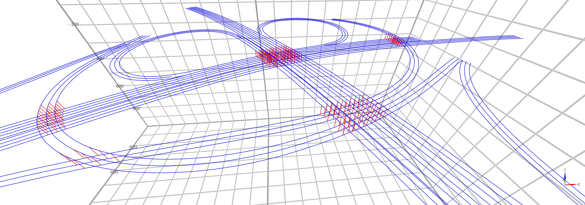

# fast crossing



(See jupyter notebook [here](https://github.com/cubao/index/blob/master/docs/notebooks/fast-crossing.ipynb))

<!--intro-start-->

Fast polyline (line segments) intersection (fast version of bentley-ottmann).

## Installation

### via pip

```bash
pip install -U fast-crossing
```

### from source

```bash
git clone --recursive https://github.com/cubao/fast-crossing
pip install ./fast-crossing
```

Or

```bash
pip install git+https://github.com/cubao/fast-crossing.git
```

(you can build wheels for later reuse by ` pip wheel git+https://github.com/cubao/fast-crossing.git`)

## Related

Inspired by [anvaka/isect: Segments intersection detection library](https://github.com/anvaka/isect).

<!--intro-end-->

## Usage & Tests

See [`tests/test_basic.py`](tests/test_basic.py):

```python
import numpy as np
import pytest
from fast_crossing import FastCrossing


def test_fast_crossing():
    fc = FastCrossing()

    # add your polylines
    """
                    2 C
                    |
                    1 D
    0               |                  5
    A---------------o------------------B
                    |
                    |
                    -2 E
    """
    fc.add_polyline(np.array([[0.0, 0.0], [5.0, 0.0]]))  # AB
    fc.add_polyline(np.array([[2.5, 2.0], [2.5, 1.0], [2.5, -2.0]]))  # CDE

    # build index
    fc.finish()

    # num_poylines
    assert 2 == fc.num_poylines()
    rulers = fc.polyline_rulers()
    assert len(rulers) == 2
    ruler0 = fc.polyline_ruler(0)
    ruler1 = fc.polyline_ruler(1)
    assert not ruler0.is_wgs84()
    assert not ruler1.is_wgs84()
    assert ruler0.length() == 5
    assert ruler1.length() == 4
    assert fc.polyline_ruler(10) is None

    # intersections
    ret = fc.intersections([1.5, 0], [3.5, 2])
    assert len(ret) == 2
    assert np.linalg.norm(fc.coordinates(ret[0]) - [1.5, 0, 0]) < 1e-15
    assert np.linalg.norm(fc.coordinates(ret[1]) - [2.5, 1, 0]) < 1e-15
    xyz = fc.coordinates(0, 0, 0.2)
    assert np.linalg.norm(xyz - [1.0, 0, 0]) < 1e-15
    with pytest.raises(IndexError) as excinfo:
        xyz = fc.coordinates(2, 0, 0.5)
    assert "map::at" in str(excinfo)

    # query all line segment intersections
    # [
    #    (array([2.5, 0. ]),
    #     array([0.5       , 0.33333333]),
    #     array([0, 0], dtype=int32),
    #     array([1, 1], dtype=int32))
    # ]
    ret = fc.intersections()
    # print(ret)
    assert len(ret) == 1
    for xy, ts, label1, label2 in ret:
        # xy: intersection point, 2D ('o' in previous illustration)
        # t,s: interpolation ratio (0.5, 0.33)
        #        0.5  ->   o at AB t=1/2
        #        0.33 ->   o at DE s=1/3
        # label1: line segment index, (polyline_index, point_index)
        #        e.g. (0, 0)，first segment of polyline AB (AB is the first polyline)
        # label2: line segment index
        #        e.g. (1, 1)，second segment of polyline CDE
        # print(xy)
        # print(ts)
        # print(label1)
        # print(label2)
        assert np.all(xy == [2.5, 0])
        assert np.all(ts == [0.5, 1 / 3.0])
        assert np.all(label1 == [0, 0])
        assert np.all(label2 == [1, 1])

    # query intersections against provided polyline
    polyline = np.array([[-6.0, -1.0], [-5.0, 1.0], [5.0, -1.0]])
    ret = fc.intersections(polyline)
    ret = np.array(ret)  # convert to numpy
    xy = ret[:, 0]  # take all intersection points (2D)
    ts = ret[:, 1]  # all interpolation ratios
    label1 = ret[:, 2]  # all labels (of current polyline）
    label2 = ret[:, 3]  # all labels in tree
    # print(ret, xy, ts, label1, label2)
    assert np.all(xy[0] == [0, 0])
    assert np.all(xy[1] == [2.5, -0.5])
    assert np.all(ts[0] == [0.5, 0])
    assert np.all(ts[1] == [0.75, 0.5])
    assert np.all(label1 == [[0, 1], [0, 1]])
    assert np.all(label2 == [[0, 0], [1, 1]])

    polyline2 = np.column_stack((polyline, np.zeros(len(polyline))))
    ret2 = np.array(fc.intersections(polyline2[:, :2]))
    assert str(ret) == str(ret2)


def test_fast_crossing_intersection3d():
    fc = FastCrossing()
    """
                    2 C
                    |
                    1 D
    0               |                  5
    A---------------o------------------B
                    |
                    |
                    -2 E
    """
    fc.add_polyline(np.array([[0.0, 0.0, 0.0], [5.0, 0.0, 100]]))  # AB
    fc.add_polyline(np.array([[2.5, 2.0, 0.0], [2.5, 1.0, 100], [2.5, -2.0, 0]]))  # CDE
    fc.finish()
    ret = fc.intersections()
    assert len(ret) == 1
    ret = ret[0]
    xyz1 = fc.coordinates(ret, second=False)
    xyz2 = fc.coordinates(ret)
    assert np.linalg.norm(xyz1 - [2.5, 0, 50]) < 1e-10
    assert np.linalg.norm(xyz2 - [2.5, 0, 2 / 3 * 100.0]) < 1e-10


def test_fast_crossing_auto_rebuild_flatbush():
    fc = FastCrossing()
    fc.add_polyline(np.array([[0.0, 0.0, 0.0], [5.0, 0.0, 100]]))  # AB
    fc.add_polyline(np.array([[2.5, 2.0, 0.0], [2.5, 1.0, 100], [2.5, -2.0, 0]]))  # CDE
    ret = fc.intersections()
    assert len(ret) == 1

    fc.add_polyline([[1.5, 0], [3.5, 2]])
    ret = fc.intersections()
    assert len(ret) == 4  # should dedup to 3?


def test_fast_crossing_filter_by_z():
    fc = FastCrossing()
    fc.add_polyline([[0, 0, 0], [1, 0, 0]])
    fc.add_polyline([[0, 0, 10], [1, 0, 10]])
    fc.add_polyline([[0, 0, 20], [1, 0, 20]])
    ret = fc.intersections([[0.5, -1], [0.5, 1]])
    assert len(ret) == 3

    ret = fc.intersections([[0.5, -1], [0.5, 1]], z_min=-1, z_max=1)
    assert len(ret) == 1
    assert fc.coordinates(ret[0])[2] == 0

    ret = fc.intersections([[0.5, -1, 10], [0.5, 1, 10]], z_min=-1, z_max=1)
    assert len(ret) == 1
    assert fc.coordinates(ret[0])[2] == 10

    ret = fc.intersections([[0.5, -1, 20], [0.5, 1, 20]], z_min=-1, z_max=1)
    assert len(ret) == 1
    assert fc.coordinates(ret[0])[2] == 20

    ret = fc.intersections([[0.5, -1, 15], [0.5, 1, 15]], z_min=-6, z_max=6)
    assert len(ret) == 2
    assert fc.coordinates(ret[0])[2] == 10
    assert fc.coordinates(ret[1])[2] == 20


def test_fast_crossing_dedup():
    # should be stable
    for _ in range(100):
        fc = FastCrossing()
        fc.add_polyline([[0, 0, 0], [1, 0, 0], [2, 0, 0]])
        fc.add_polyline([[0, 1, 0], [1, 1, 0], [2, 1, 0]])

        ret = fc.intersections([[1, -1], [1, 1]])
        assert len(ret) == 2
        assert np.all(ret[0][-1] == [0, 0]), ret
        assert np.all(ret[1][-1] == [1, 0]), ret
        assert ret[0][1][1] == 1.0, ret
        assert ret[1][1][1] == 1.0, ret

        ret = fc.intersections([[1, -1], [1, 1]], dedup=False)
        # for idx, row in enumerate(ret):
        #     print(idx, row)
        assert len(ret) == 4
```
